# AI Career Growth Navigator - System Architecture

## 1. System Architecture Overview

The **AI Career Growth Navigator** is designed around a specialized Multi-Agent structure. A central Orchestrator coordinates a team of 5 domain-specific Gemini-powered agents. The system utilizes the **Model Context Protocol (MCP)** interface layer, standardizing how agents discover and invoke external logic blocks (Tools).

A Streamlit-based UI acts as the client layer, managing user input, feedback adaptation loops, and dashboard visualization. The Memory Agent operates globally, persistently recording states and tracks historical recommendations.

### Architecture Mermaid Diagram

```mermaid
sequenceDiagram
    participant User
    participant Streamlit_UI as app.py
    participant Supervisor as Orchestrator
    participant A1 as Profile Agent
    participant A2 as Skill Gap Agent
    participant A3 as Roadmap Agent
    participant A4 as Project Agent
    participant A5 as Opportunity Agent
    participant MCP_Registry as MCP Tools & APIs

    User->>Streamlit_UI: "I want to be an AI Engineer!"
    Streamlit_UI->>Supervisor: .run_career_analysis(skills, goal)
    
    %% PROFILE & GAP PHASE (Sequential) %%
    rect rgb(30, 41, 59)
        Supervisor->>A1: .analyze(skills, goal)
        A1->>MCP_Registry: [MCP: profile_tool] extract & structure
        MCP_Registry-->>A1: {"current_competencies": [...]}
        A1-->>Supervisor: profile_res
        
        Supervisor->>A2: .identify_gaps(current_competencies, goal)
        A2->>MCP_Registry: [MCP: skill_gap_tool] compare & diff
        MCP_Registry-->>A2: {"missing_skills": [...]}
        A2-->>Supervisor: gap_res
    end

    %% ACTIONABLE GENERATION PHASE (Parallel) %%
    rect rgb(51, 65, 85)
        par Roadmap Action
            Supervisor->>A3: .generate_roadmap(missing_skills, weeks)
            A3->>MCP_Registry: [MCP: roadmap_tool] schedule
            MCP_Registry-->>A3: {"weekly_schedule": {...}}
            A3-->>Supervisor: roadmap_res
        and Portfolio Project
            Supervisor->>A4: .recommend(missing_skills, goal)
            A4->>MCP_Registry: [MCP: project_tool] ideate portfolio
            MCP_Registry-->>A4: {"project_spec": {...}}
            A4-->>Supervisor: project_res
        and Opportunity Sourcing
            Supervisor->>A5: .discover(missing_skills, goal)
            A5->>MCP_Registry: [MCP: opportunity_tool] GitHub HTTP API
            MCP_Registry-->>A5: {"live_issues": [...]}
            A5-->>Supervisor: opp_res
        end
    end
    
    %% PERSISTENCE phase %%
    Supervisor->>MCP_Registry: [MCP: memory_tool] save(final_state)
    Supervisor->>Streamlit_UI: Returns full knowledge graph

    %% FEEDBACK ADAPTATION LOOP %%
    rect rgb(71, 20, 30)
        User->>Streamlit_UI: "Adapt roadmap: I only have 2 hours a week."
        Streamlit_UI->>Supervisor: .adapt_roadmap(feedback, current_roadmap)
        Supervisor->>A3: .regenerate_with_feedback(feedback)
        A3->>MCP_Registry: [MCP: roadmap_tool] recalculate time
        MCP_Registry-->>A3: {"adapted_schedule": {...}}
        A3-->>Supervisor: new_roadmap_res
        Supervisor->>Streamlit_UI: Updates UI
    end
```



### Data Flow
1. **User Input:** The user provides their career goals and current skill lists via Streamlit UI. 
2. **Analysis:** The Orchestrator routes the input to the **Profile Analysis Agent**, which maps out a structured proficiency matrix.
3. **Gap Detection:** The proficiency matrix is passed to the **Skill Gap Agent**, which compares current skills to industry standards for the target career.
4. **Actionable Outputs:** The gap analysis is broadcast to:
   - **Learning Roadmap Agent** (creates weekly learning schedules)
   - **Project Recommendation Agent** (generates a custom tailored portfolio project)
   - **Opportunity Discovery Agent** (queries live GitHub issues to find good first issues)
5. **Persistence:** Throughout the run, the **Memory Agent** logs newly generated insights natively using `memory_tool.py`.
6. **Execution & Feedback Loop:** The user can give explicit feedback on the roadmap and trigger a selective regeneration.

---

## 2. Folder Structure

The project will be strictly modular, dividing concerns between the Streamlit UI, Agent configurations, and MCP Tool interfaces.

```text
/
├── .env.example             # Secure API key templates
├── requirements.txt         # Dependency tree 
├── Dockerfile               # Deployment configurations
├── README.md                # Project landing documentation
├── ARCHITECTURE.md          # System architecture breakdown
├── DEVELOPMENT_PLAN.md      # Phased implementation schedule
├── src/                     # Source directory
│   ├── app.py               # the Streamlit Orchestrator UI Entry Point
│   ├── agents/
│   │   ├── __init__.py
│   │   ├── profile.py       # Profile Analysis Agent
│   │   ├── skill_gap.py     # Skill Gap Agent
│   │   ├── roadmap.py       # Learning Roadmap Agent
│   │   ├── opportunity.py   # Opportunity Discovery Agent
│   │   ├── project.py       # Project Recommendation Agent
│   │   ├── memory.py        # Memory Agent
│   │   └── supervisor.py    # Inter-agent message routing
│   ├── tools/               # MCP Standardized Tool Layer
│   │   ├── mcp_base.py      # MCP tool registration protocol schema
│   │   ├── profile_tool.py
│   │   ├── skill_gap_tool.py
│   │   ├── roadmap_tool.py
│   │   ├── opportunity_tool.py
│   │   ├── project_tool.py
│   │   └── memory_tool.py
```

---

## 3. Development Plan

We will assemble this project iteratively to ensure all integrations are functional and beginner-friendly:

**Phase 1: Foundation & Tooling Architecture**
- Define `requirements.txt` and `.env.example` to secure the Gemini API Key.
- Build the `mcp_base.py` capability to demonstrate correct tool registration formats.
- Implement the baseline `memory_tool.py` and `Memory Agent` so the system has object permanence.

**Phase 2: Core Analysis Loop**
- Implement `profile_tool.py` and `skill_gap_tool.py`.
- Implement **Profile Analysis Agent** & **Skill Gap Agent**.
- Connect a basic Streamlit UI (`src/app.py`) to intake user profiles and output basic target mappings.

**Phase 3: Actionable Generation**
- Construct the `roadmap_tool.py` and `project_tool.py`.
- Integrate the **Learning Roadmap Agent** and **Project Recommendation Agent**.
- Render these lists cleanly into the Streamlit UI as interactive dashboards.

**Phase 4: Opportunities & Progress Tracker**
- Build the **Opportunity Discovery Agent** (focused on simulated data for Kaggle/Hackathons, or real queries if applicable).
- Build the **Progress Tracking Agent** tracking completed modules.
- Ensure the Memory agent commits progressed tasks.

**Phase 5: Deployability & Polish**
- Generate the final `Dockerfile` using Python 3.10+ lightweight images.
- Comment code heavily for the Kaggle Judges.
- Complete the final `README.md` and Deployment guides.
