# Kaggle Capstone Judge Review

As a Principal AI Engineer and Kaggle Capstone Judge, I have reviewed your current workflow. The original architecture was a solid baseline, but to achieve a top-tier score, it needed a clearer demonstration of MCP, real-world data integration, separation of concerns (Projects vs. Opportunities), and an agentic feedback loop. 

Here is my review, followed by the improved workflow and architectural diagram.

---

## 🚀 Improvements & Scoring Rationale

### 1. Explicit MCP Context Usage
* **Improvement:** The workflow now explicitly shows the agents querying the `MCP Schema Registry` before invoking tools.
* **Why it improves Kaggle Scoring:** The Model Context Protocol (MCP) is a key judging criterion. Implicitly using JSON schemas is okay, but explicitly demonstrating the MCP pattern (Standardized Schema Discovery -> LLM Generation -> Deterministic Tool Invocation) proves you understand standard tool-use protocols.

### 2. Opportunity Discovery via Real Sources (GitHub API)
* **Improvement:** The `opportunity_tool.py` is updated to make live HTTP requests via the GitHub REST API (e.g., searching for "good first issue" tags based on missing skills).
* **Why it improves Kaggle Scoring:** Static/mocked data severely limits score potential. Integrating a real-world API proves the agent can interface with active ecosystems. GitHub's API is public and requires no auth for basic searches, making it perfectly simple for a 2-week solo project.

### 3. Separation of Project Recommendation Agent
* **Improvement:** Split out `ProjectAgent` and `project_tool.py`. The `ProjectAgent` generates portfolio-building projects (e.g., "Build a full-stack Next.js clone"), while the `OpportunityAgent` finds external competitions/issues.
* **Why it improves Kaggle Scoring:** It increases multi-agent complexity in a meaningful way. Generating a tailored portfolio project requires different prompt context and schema than searching external APIs for hackathons.

### 4. Agentic Feedback Adaptation Loop
* **Improvement:** Added a feedback phase. If the user says, "I only have 5 hours a week," the system routes this feedback back to the Supervisor, which selectively re-triggers the `RoadmapAgent` to adapt the schedule.
* **Why it improves Kaggle Scoring:** It transforms the system from a "prompt chain" (one-and-done pipeline) into a true **Agentic System** capable of self-correction and memory-based looping.

### 5. Solo Developer Feasibility
* **Improvement:** The architecture is capped at 6 Agents. The real-world data is limited to a single public API (GitHub Search) instead of complex authenticated endpoints like Kaggle (which require CLI credentials).
* **Why it improves Kaggle Scoring:** Execution matters more than ambition. A working pipeline with GitHub issues is worth far more than a broken pipeline attempting 5 different APIs.

---

## 📊 Updated Mermaid Sequence Diagram

```mermaid
sequenceDiagram
    participant User
    participant Streamlit_UI as app.py
    participant Supervisor as Orchestrator
    participant A1 as Profile Agent
    participant A2 as Skill Gap Agent
    participant A3 as Roadmap Agent
    participant A4 as Project Agent
    participant A5 as Opportunity Agent
    participant MCP_Registry as MCP Tools & APIs

    User->>Streamlit_UI: "I want to be an AI Engineer!"
    Streamlit_UI->>Supervisor: .run_career_analysis(skills, goal)
    
    %% PROFILE & GAP PHASE (Sequential) %%
    rect rgb(30, 41, 59)
        Supervisor->>A1: .analyze(skills, goal)
        A1->>MCP_Registry: [MCP: profile_tool] extract & structure
        MCP_Registry-->>A1: {"current_competencies": [...]}
        A1-->>Supervisor: profile_res
        
        Supervisor->>A2: .identify_gaps(current_competencies, goal)
        A2->>MCP_Registry: [MCP: skill_gap_tool] compare & diff
        MCP_Registry-->>A2: {"missing_skills": [...]}
        A2-->>Supervisor: gap_res
    end

    %% ACTIONABLE GENERATION PHASE (Parallel) %%
    rect rgb(51, 65, 85)
        par Roadmap Action
            Supervisor->>A3: .generate_roadmap(missing_skills, weeks)
            A3->>MCP_Registry: [MCP: roadmap_tool] schedule
            MCP_Registry-->>A3: {"weekly_schedule": {...}}
            A3-->>Supervisor: roadmap_res
        and Portfolio Project
            Supervisor->>A4: .recommend(missing_skills, goal)
            A4->>MCP_Registry: [MCP: project_tool] ideate portfolio
            MCP_Registry-->>A4: {"project_spec": {...}}
            A4-->>Supervisor: project_res
        and Opportunity Sourcing
            Supervisor->>A5: .discover(missing_skills, goal)
            A5->>MCP_Registry: [MCP: opportunity_tool] GitHub HTTP API
            MCP_Registry-->>A5: {"live_issues": [...]}
            A5-->>Supervisor: opp_res
        end
    end
    
    %% PERSISTENCE phase %%
    Supervisor->>MCP_Registry: [MCP: memory_tool] save(final_state)
    Supervisor->>Streamlit_UI: Returns full knowledge graph

    %% FEEDBACK ADAPTATION LOOP %%
    rect rgb(71, 20, 30)
        User->>Streamlit_UI: "Adapt roadmap: I only have 2 hours a week."
        Streamlit_UI->>Supervisor: .adapt_roadmap(feedback, current_roadmap)
        Supervisor->>A3: .regenerate_with_feedback(feedback)
        A3->>MCP_Registry: [MCP: roadmap_tool] recalculate time
        MCP_Registry-->>A3: {"adapted_schedule": {...}}
        A3-->>Supervisor: new_roadmap_res
        Supervisor->>Streamlit_UI: Updates UI
    end
```

